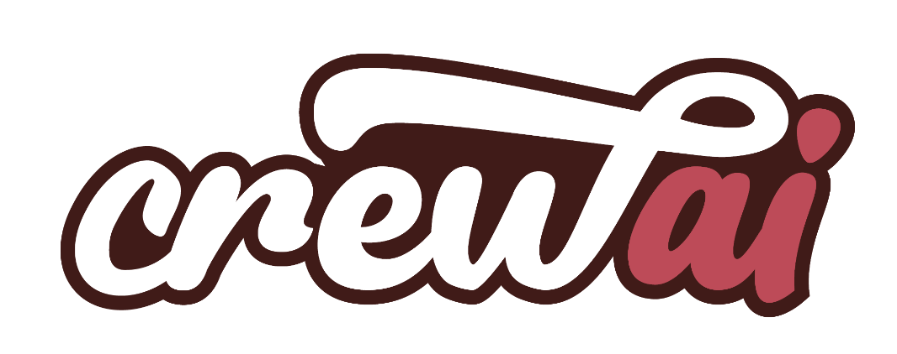

# CrewAI-NewsAgent



Created a News Agent utilising two Google Gemini LLM Agents from CrewAI.  [CrewAI](https://www.crewai.com/) is a framework that enables the automation of multi-agent collaboration on complex tasks based on role assigment. 


## Set Up

This project can be replicated by cloning this repository and installing the dependencies mentioned in `requirements.txt`.   
1. Start by creating a conda environment.  
    ```
        conda create --name <env_name> python=<python_version>
    ```
2. Activate the new environment.
    ```
        conda activate <env_name>
    ```
3. Install dependencies.
    ```
        pip install -r requirements.txt
    ```


## Process Overview

* The project uses two agents, i.e.; the `news_researcher` and the `news_writer` to sequentially research about a given topic and then write a blog about it.
* The `news_researcher` utilizes the `Serper` tool, known as the fastest Google Search API to research and collect sources about the given topic.
* The `news_researcher` then delegates the task of writing a blog based on the collected information to the `news_writer` agent as defined in the `crew` object based on the `Process.sequential` parameter.
* The resultant blog is written down and stored in the `news-blog-post.md`
